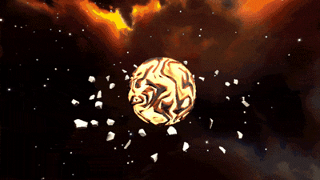
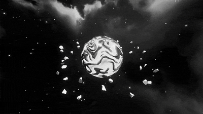
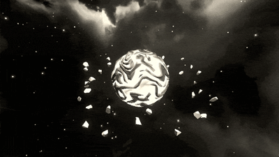
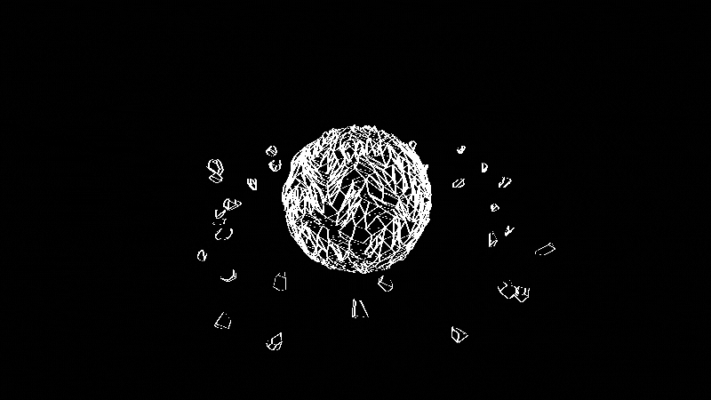
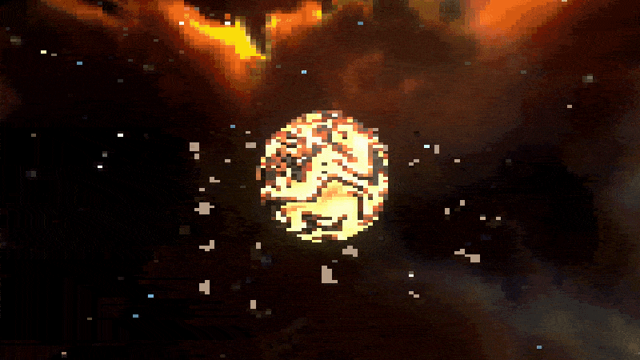
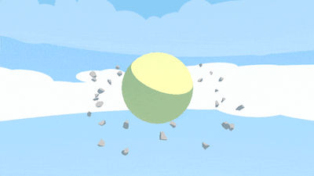

# 🎨 Rendering Experiments using Unity's URP

## Introduction
This project presents various experiments with the Universal Render Pipeline renderer features [v. 14.0]

## Technology Stack
`Unity` `C#` `URP` `ShaderGraph` `HLSL` `Cg`

## Media

  
  &nbsp
  

  
  &nbsp
  

  
  &nbsp
  

  
  &nbsp
  

